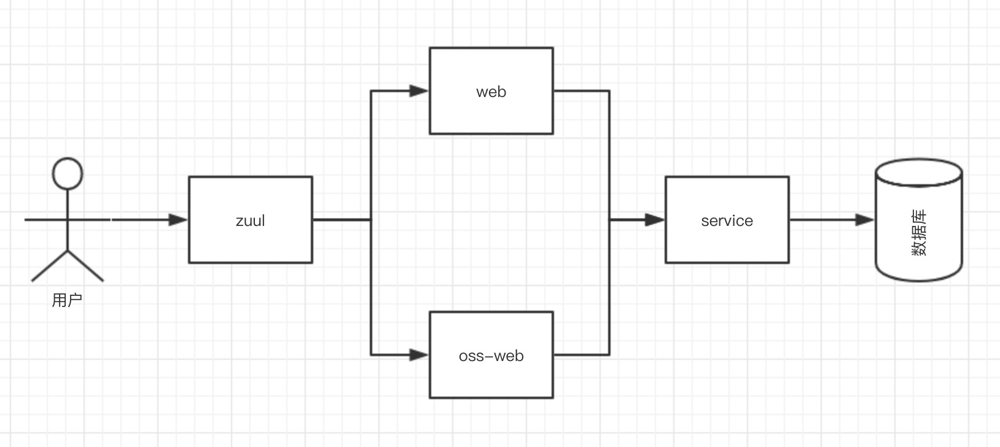

## 物品循环

 - API提供了相关的对接接口
 - CORE提供了核心插件
 - SERVICE提供了链接数据库的相关接口
 - SSO提供B端接口
 - WEB提供C端接口
 
## 服务调用流程图 

**注：API、CORE、CLIENT为其他服务提供基础调用**

## 容器服务启动时需要注意

#### 运行时服务器的配置

- 在服务器上需要添加配置文件，配置文件路径为/data/config.properties
- 运行时需要在服务器上安装docker
- 在运行容器前需要重新配置网路，配置网路的网段为172.18.0.1/16

#### 部署命令

- 运行时需要使用travis进行构建
- 部署命令：deploy server/service/web/sso/delete_image/pull_image RT1.0.0
- *在发布时需要不要忘记修改版本号*